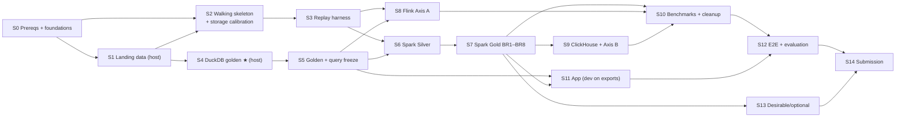

# IMPLEMENTATION PLAN — Transitometer

**Dependency-ordered stages with testing/validation at every stage, explicit run locations, and a storage budget.**

| | |
|---|---|
| **Companion to** | `PROJECT_PLAN.md` v2 (scope, architecture, BRs, evaluation) |
| **Course / domain** | CO5173 Data Engineering · Transportation |
| **Team** | 4 students — logical ownership only; **one runtime machine** |
| **Host** | ASUS TUF F15 · i7-12700H (14C/20T) · 31.6 GB RAM · Win 11 Home · Docker Desktop 4.54.0 (engine 29.1.2, Compose v2.40.3) |
| **Status** | Plan **v2.1** — host prerequisites done; no implementation started; S0 starts on owner go-ahead |
| **Date** | v1 2026-09-23 · v2 2026-09-25 · **v2.1 2026-09-25** (renamed Transitometer; soft storage guard) |
| **Repository** | `github.com/Lorcelmao/transitometer` (created in S0) |

> **Binding constraints from `PROJECT_PLAN.md`:** real data for all BR results and acceptance (§1.1) · single machine,
> one engine profile at a time (§1.2) · two-zone storage, Docker ≤ 25 GB steady, soft guard at 25/30 GB (§1.3) ·
> core = BR1–BR8 + Axis A + Axis B (§16).

---

## 1. Plan principles

1. **Integrate early, then deepen.** A walking skeleton (S2, weeks 2–3) proves the whole chain on one real hour before any KPI logic depends on it.
2. **Independent oracle before engines.** KPI semantics are fixed first as **DuckDB SQL on landing Parquet** (golden), independent of Kafka, protobuf re-encoding and Spark; every engine is graded against it.
3. **One production engine.** Spark implements the full pipeline (streaming + batch). Flink implements **only** the Axis A benchmark workload (W1, W2). No logic is written three times.
4. **Containers for JVM engines.** Spark and Flink run only in Java 17 containers; the host runs Python tooling (fetch, DuckDB golden, tests) only.
5. **Docker holds only reproducible working state.** Records (landing data, golden, results, exports) live on `D:\Transitometer-data` or in Git; the engine zone can be cleaned at phase boundaries.
6. **Tests ship with the stage.** No stage is done without its tests and exit criterion.
7. **Fairness by construction.** Shared benchmark harness; identical Kafka offsets; latency from Kafka append times.

---

## 2. Stage map

| Stage | Goal | Depends on | Runs on | Primary test focus |
|---|---|---|---|---|
| **S0** | Host prerequisites, repo, tooling, pinned images, Compose | — | host + Docker | lint, `compose config`, image digest check, storage baseline |
| **S1** | Real-data acquisition → landing zone + manifest | S0 | host | checksums, provenance, GTFS validity, measured volumes |
| **S2** | **Walking skeleton** + storage calibration gate | S0, S1 (1 hour of data) | Docker | E2E smoke on real hour; measured footprint vs budget |
| **S3** | Replay harness + canonical schemas (protobuf re-encode) | S2 | host (unit) + Docker (integration) | round-trip fidelity, pacing, determinism, fault injection |
| **S4** | DuckDB golden KPIs ★ | S1 | host | hand-checked samples, invariants, service-day edge cases |
| **S5** | Golden freeze + correctness harness + 25-query suite | S4 | host | byte-reproducible golden; frozen suite |
| **S6** | Spark Silver (decode, dedup, stop events, schedule join, DQ) | S3, S5 | Docker (`spark`) | Silver vs golden intermediates; conservation; idempotence |
| **S7** | Spark Gold BR1–BR8 (streaming + batch) + Delta maintenance | S6 | Docker (`spark`) | Gold vs golden; late data; recovery; time travel |
| **S8** | Flink Axis A workload (W1, W2) | S3, S5 | Docker (`flink`) | parity vs golden and vs Spark on identical offsets |
| **S9** | ClickHouse + Axis B serving comparison | S7 | Docker (`clickhouse`) | 25-query parity across B1/B2/B3 |
| **S10** | Benchmarks (Axis A, Axis B, real-data scaling) + phase cleanup | S7, S8, S9 | Docker | repeatability, counterbalance, idle-host check |
| **S11** | Streamlit application (U1–U7) | S5 (dev on golden exports), S7 | host (dev) + Docker (`app`) | data-access unit tests, UI smoke, per-BR acceptance |
| **S12** | E2E, reproducibility, evaluation packaging | S10, S11 | Docker | clean-clone E2E, criteria coverage |
| **S13** | Desirable/optional: BR9, BR10, BR11, extras | S7 (BR9/10), S1 (BR11) | Docker / host | parity with core pipeline, validity |
| **S14** | Submission artifacts | S12 | host | artifact checklist, group-ID naming |

---

## 3. Where things run

| Component | Host (Windows, Python 3.10 venv on D:) | Container |
|---|---|---|
| `fetch_data.py`, manifest, checksums | ✅ | — |
| DuckDB golden SQL, correctness suite, property tests | ✅ | also runnable in the Spark/tooling image (CI parity) |
| Replay harness (re-encode, pacing, faults) | unit tests | ✅ runs against Kafka (reads landing via **read-only** mount) |
| Kafka (KRaft) | — | ✅ `apache/kafka` |
| Spark Structured Streaming + batch | — | ✅ custom image FROM official Apache Spark (Java 17, Python 3) |
| Flink / PyFlink | — | ✅ custom image FROM official `flink` Java 17 + Python + PyFlink |
| ClickHouse | — | ✅ `clickhouse/clickhouse-server` (Axis B phase only) |
| Streamlit app | ✅ dev against small exports | ✅ `app` profile (same image as Spark/tooling) reading Delta via DuckDB |
| Report, slides, video | ✅ | — |

The host needs **no JDK**. Host Java 23 is irrelevant to the stack.

---

## 4. Storage budget & operations (Docker ≤ 25 GB steady)

### 4.1 Zones
- **Host zone `D:\Transitometer-data\`**: `landing/` (file-based Bronze, immutable), `golden/`, `results/`, `exports/`. Expected ~20–30 GB [E]; may grow if the window grows.
- **Engine zone (Docker disk image at `D:\DockerDesktop\DockerDesktopWSL`)**: named volumes `kafka-data`, `lakehouse` (Delta Silver/Gold + `meta.ingest_log`), `checkpoints`, `clickhouse-data` (Axis B only), `scratch` (temporary staging); images; build cache.

### 4.2 Budget by component [E — recalibrated at S2]

| Component | Steady | Controls |
|---|---|---|
| Images: Kafka + Spark/tooling | 3.0–3.5 GB | One Python-bearing Spark image also runs the replay harness, DuckDB and Streamlit; connector jars + DuckDB extensions baked; containerd store overhead included |
| Image: Flink + PyFlink | 0 outside S8/S10-A; 1.6–2.0 GB during | Pull/build in phase; remove after Axis A results are exported; digest-pinned so rebuild is identical |
| Image: ClickHouse | 0 outside S9/S10-B; ~0.7 GB during | same |
| Build cache | ≤ 2 GB | `docker builder prune --keep-storage 2GB` after every image build |
| Kafka log | ≤ 3 GB (hard) | `compression.type=zstd`; per-topic `retention.ms=86400000` and `retention.bytes` sized so all topics ≤ 3 GB; `segment.bytes=128MB`; replays regenerate from landing, so nothing depends on retention |
| Delta Silver + Gold + lineage | 5–10 GB | No Bronze payload copy (Bronze = landing on D:); Silver stores deduped observations and inferred stop events, **not** every repeated snapshot row; partition by `service_date`; `OPTIMIZE` + `VACUUM` weekly |
| Streaming checkpoints / state | ≤ 1 GB | Deleted between benchmark runs and after stage exits |
| ClickHouse data | 0 outside Axis B; 2–5 GB during | Loaded from Delta; system log tables TTL-limited; `DROP` after results exported |
| Containers + logs | < 0.5 GB | Compose `logging: max-size 10m, max-file 3`; `docker compose down` between phases |

### 4.3 Budget by phase [E]

| Phase | Docker logical usage | Notes |
|---|---|---|
| S2–S7 normal development | **~18–21 GB** | Kafka + Spark images, Delta, Kafka log, cache |
| S8 + S10-A (Flink) | ~21–23 GB | + Flink image/state |
| S9 + S10-B (ClickHouse) | ~21–25 GB | Flink image removed first; + ClickHouse image/data |
| **Temporary peak** — real-data scaling runs (7-day slice staged into `scratch`) + `OPTIMIZE` rewrite | **~30–35 GB** | Only if S2 shows mount reads > 20% of Spark runtime; otherwise read slices from the read-only mount and skip staging |

**Verdict:** ≤ 25 GB is **sustainable in normal development** with the controls above; it is **not** sustainable
through the scaling/compaction peak. **Compromise target:** ≤ 25 GB steady, peaks confined to scheduled windows and followed by cleanup + compaction.
Docker Desktop 4.54 (WSL2 mode) offers **no hard disk-usage limit**, so the ceiling is enforced by the **soft storage
guard** `python tasks.py storage-check` (reads `docker system df` + VHDX file size): **warn ≥ 25 GB**, **refuse to start new
engine runs ≥ 30 GB** (override only via an explicit flag during a scheduled peak phase). Every `tasks.py up <profile>`,
`tasks.py replay` and `tasks.py bench` task calls it first.

### 4.4 Docker disk image behaviour (measured)
`docker_data.vhdx` is **non-sparse**: the file keeps its high-water size after data is deleted. Therefore:
- **Phase-boundary compaction** after S10 peaks (and whenever the file exceeds ~30 GB while logical usage is ≤ 25 GB): stop Docker Desktop → `wsl --shutdown` → `diskpart` `select vdisk file=...` / `attach vdisk readonly` / `compact vdisk` / `detach vdisk` (admin). Owner runs or approves each time.
- **Last-resort reset:** because the engine zone is reproducible, *Troubleshoot → Clean / Purge data* + rebuilding images and re-running from landing is an acceptable recovery path (costs rebuild time, not data).

### 4.5 Operations checklist
- **Weekly:** `docker system df -v`, VHDX file size, `du` of named volumes → append to `results/storage-log.csv`.
- **After image builds:** `docker builder prune --keep-storage 2GB`; `docker image prune` (dangling only).
- **Before every benchmark run:** `docker ps` shows only the arm under test + Kafka; checkpoints cleared.
- **Phase exit (S8, S9, S10):** export results to `results/`, then remove that phase's image, volumes and checkpoints; record before/after in the storage log.
- **Never:** bind-mount `landing/` read-write; build images with data in context (build contexts are only the small `docker/spark-tools/` and `docker/flink-py/` folders).

---

## 5. Detailed stages

Each stage: **Goal → Deliverables → Tests → Exit.**

### S0 — Host prerequisites & foundations
- **Status (2026-09-25):** ✅ implemented and verified — `tasks.py check` green (31 tests), compose valid for all profiles, lock digests verified, storage baseline logged; independent code review + test pass findings resolved. Build-time items deferred to the stages that first build each image (S2 Spark image, S8 Flink image, S9 ClickHouse).
- **Goal:** a cloneable repo and a host whose Docker storage is on D: within budget.
- **Deliverables:**
  - **Host prerequisites — ✅ done 2026-09-25:** Docker disk image at `D:\DockerDesktop\DockerDesktopWSL`; `.wslconfig` `memory=18GB` + `swapFile=D:\WSL\swap.vhdx`; `D:\Transitometer-data\{landing,golden,results,exports}`. Hard disk limit unavailable → soft storage guard below.
  - Git repo `Lorcelmao/transitometer` + branch/PR policy; `pyproject.toml` (ruff, mypy, pytest); `src/` layout; `tasks.py` stdlib task runner (`check compose-config verify-lock storage-check storage-report up <profile> down`, later `fetch golden replay bench clean-phase`); `.gitignore`; `config/` (env-driven, no secrets).
  - `docker/compose.yaml`: `kafka` (no profile), profiles `spark`, `flink`, `clickhouse`, `app`; named volumes; logging limits.
  - Pinned versions: Spark 4.x + matching Delta 4.x pair; Flink 2.x + `flink-connector-kafka` 4.x; image digests.
  - Two custom Dockerfiles: `spark-tools` (Spark + Delta + Kafka connector jars, `gtfs-realtime-bindings`, `protobuf`, `pyarrow`, `duckdb` + `delta`/`spatial` extensions pre-installed, `streamlit`); `flink-py` (Flink + Python + PyFlink + Kafka connector). Flink image is **authored** here but built in S8.
- **Tests:** `python tasks.py check` green; `docker compose config -q`; image digests match lock file; storage baseline recorded (VHDX path on D:, size, `docker system df`).
- **Exit:** fresh clone → `python tasks.py check` green; Docker disk verified on D:.

### S1 — Real-data acquisition & landing zone — host
- **Goal:** real data pinned and measured.
- **Deliverables:** `data-manifest.yaml` (URL, retrieval timestamp, licence, SHA-256, rows, bytes); `fetch_data.py`:
  - gtfsrt.io Parquet: **MTA Bus** trip updates + vehicle positions and **one subway feed group** (default `nyct/gtfs`) for the **14-day core window**;
  - GTFS static: subway versions from gtfsrt.io `schedules/` covering the window; MTA Bus static from MTA (+ Mobility Database historical versions if needed);
  - BR9 history: **corridor subset** (default: the subway group, Jan 2026 →, filtered at download with pyarrow predicates) — size capped;
  - Hanoi GTFS + OSM extract (BR11), Open-Meteo (BR10) — small.
  - **Golden window:** 48 h sub-window of the core window (no separate download).
- **Decision gates:** (1) static-schedule versions exist for every core-window date (else move the window into one static version); (2) measured size of window + history within ~30 GB host-zone target (else shrink window/corridor).
- **Tests:** checksum verification; schema presence per file; GTFS validity (`gtfs_kit`); licence per source; rows/bytes per day recorded.
- **Exit:** `python tasks.py fetch` reproduces the landing zone from the manifest; volume report committed.

### S2 — Walking skeleton & storage calibration — Docker
- **Goal:** prove the whole chain on **one real hour** and calibrate the storage budget.
- **Deliverables:** minimal re-encoder (one snapshot → `FeedMessage` → per-entity Kafka messages); Kafka topic setup with the §4.2 retention/compression settings; Spark streaming job decoding protobuf → Silver Delta table; DuckDB query over that Delta table; one Streamlit chart.
- **Measurements (feed §4 recalibration):** image sizes after build; Kafka bytes per replayed hour; Silver bytes per hour; checkpoint size; Spark time share spent reading the read-only mount (decides scale-run staging); VHDX size.
- **Tests:** E2E smoke (row counts landing → Kafka → Silver consistent); container restart does not duplicate Silver rows.
- **Exit:** skeleton runs from `python tasks.py skeleton`; `results/storage-calibration.md` projects steady usage ≤ 25 GB (or the owner approves an adjusted window/target).

### S3 — Replay harness & canonical schemas
- **Goal:** deterministic, paced, real-data event stream — the fairness backbone.
- **Deliverables:** full re-encoder for trip updates + vehicle positions (alerts optional); per-entity messages keyed by `trip_id`/`vehicle_id`, headers (feed, snapshot timestamp, `source_file`); pacing by original timestamps × speed factor; **fault injection** (duplicates, lateness 0/30/120 s, outages) behind explicit labelled flags; canonical schemas (typed records, service-day, `>24:00` times); lineage emission (`source_file` → offsets).
- **Tests:** **round-trip fidelity** (archive rows → protobuf → decoded rows equal on all fields used by any BR); seeded determinism (same seed → identical byte stream and offsets); pacing accuracy; message size < broker limit; fault flags never enabled in BR/acceptance runs.
- **Exit:** replaying the golden window yields entity counts equal to the manifest-derived counts.

### S4 — DuckDB golden KPIs — host ★ highest algorithmic risk
- **Goal:** define every core KPI's semantics as independent SQL on landing Parquet.
- **Deliverables:** SQL for dedup; **stop-event inference** (trip updates: last prediction before a stop leaves the update list; vehicle positions: `STOPPED_AT` / stop-sequence advance); schedule join with service-day logic; BR1 OTP; BR2 headway/bunching; BR3 missing trips; BR4 segment times + attribution; BR5 scorecard + bootstrap CI; BR6 rule-based early-warning labels; BR7 feed-quality metrics; BR8 per-stop reliability.
- **Tests:** hand-checked spot samples (documented); invariants (conservation, no unknown `trip_id`, bbox, no pre-service timestamps); edge cases (DST, `>24:00`, missing/duplicate snapshots, trip ID churn).
- **Exit:** all core KPIs computed on the golden window, matching hand-checked values within the declared tolerance.

### S5 — Golden freeze & correctness harness — host
- **Goal:** freeze reference answers and the query suite.
- **Deliverables:** frozen golden results (Parquet in `golden/` + checksums in Git); tolerance policy; reusable property-test library; **25-query Axis B suite** with golden answers; `python tasks.py golden`.
- **Tests:** byte-reproducible golden re-run; suite executes on DuckDB.
- **Exit:** **dataset + query freeze (end of week 6)**; golden checksums committed.

### S6 — Spark Silver — Docker (`spark`)
- **Goal:** production Silver layer from the replayed stream (and batch from landing for history).
- **Deliverables:** protobuf decode; watermarking; dedup; stop-event inference (same rules as S4, independently implemented); schedule join; teleport/outlier suppression; quality gates → dead-letter table; Silver tables (`silver.vehicle_positions`, `silver.stop_events`, `silver.trip_predictions_sampled` for BR6, `silver.feed_snapshots` for BR7); `meta.ingest_log`; partitioning by `service_date`.
- **Tests:** Silver intermediates vs golden intermediates; conservation `in = out + late_dropped + dead_lettered`; idempotent re-run (no duplicates after restart); schema-enforcement test.
- **Exit:** Silver for the golden window matches golden intermediates within tolerance.

### S7 — Spark Gold BR1–BR8 + Delta maintenance — Docker (`spark`)
- **Goal:** all core KPIs, streaming where freshness matters (BR1, BR2, BR6, BR7) and batch elsewhere (BR3, BR4, BR5, BR8), one code path.
- **Deliverables:** Gold tables per BR; **benchmark mode** emitting W1/W2 results to `kpi.spark.*` Kafka topics; checkpointing; `OPTIMIZE`/`VACUUM` job (time-travel demo table exempt until the demo is recorded); Gold exports to `exports/`.
- **Tests:** Gold vs golden per BR; late-event scenarios 0/30/120 s (labelled fault runs); restart recovery after `kill -9` (time-to-resume); **Delta time-travel re-read of a corrected late arrival**; duplicate idempotency.
- **Exit:** all BR1–BR8 Gold outputs match golden within tolerance; recovery under declared SLO.

### S8 — Flink Axis A workload — Docker (`flink`)
- **Goal:** the mandatory alternative, on an identical workload.
- **Deliverables:** build `flink-py` image; PyFlink jobs for **W1** (1-min tumbling event-time delay stats per route/stop) and **W2** (keyed stateful headway per route/direction/stop), same watermark policy and inference rules as Spark; sink `kpi.flink.*`.
- **Tests:** parity vs golden and vs Spark on identical offsets; output-schema equivalence; fairness assertions (same topic/offsets, caps, pace).
- **Exit:** both arms produce comparable W1/W2 outputs; deviations explained.

### S9 — ClickHouse & Axis B — Docker (`clickhouse`)
- **Goal:** serving comparison B1 Spark SQL over Delta · B2 DuckDB over Delta · B3 ClickHouse.
- **Deliverables:** ClickHouse config with capped system logs; loader from Delta Gold/Silver; the 25 queries for each arm; optional zero-copy sub-arm (DuckDB `read_parquet` over Delta data files after `OPTIMIZE`+`VACUUM`).
- **Tests:** parity of all 25 queries vs golden on every arm; load/freshness timing captured.
- **Exit:** all arms return golden-equal results (or documented, explained differences).

### S10 — Benchmarks & phase cleanup — Docker
- **Goal:** evaluation evidence.
- **Deliverables:** fairness contract (published first); **Axis A** runs (latency p50/p95/p99 from Kafka append times, throughput knee, late-data correctness, recovery, memory) → then **remove Flink image/state**; **Axis B** runs (cold/warm latency, freshness, footprint, compaction effect) → then **drop ClickHouse data/image**; **real-data scaling** (1/3/7-day slices; 14 optional) of Silver building in Spark; raw CSVs + plotting scripts in `results/`; post-phase compaction.
- **Tests:** ≥3 runs with spread; counterbalanced order; idle-host check; input checksums identical across arms; "what we did not test" declared.
- **Exit:** results reproducible from committed CSVs; storage log shows return to ≤ 25 GB steady.

### S11 — Application — host dev + Docker (`app`)
- **Goal:** demonstrate data exploitation per BR.
- **Deliverables:** Streamlit app: U1 reliability console, U2 diagnostics, U3/U4 scorecards and trends, U5 departure confidence, U6 feed health, U7 Hanoi map; data-access layer over DuckDB (Delta + Spatial). Development starts from golden/Gold exports on the host; integration reads the live `lakehouse` volume in the `app` profile.
- **Tests:** data-access unit tests; UI smoke tests; **per-BR acceptance tests on real data** (§6.3); time-to-insight task timings.
- **Exit:** every core BR (BR1–BR8) demonstrable in-app with recorded evidence.

### S12 — E2E, reproducibility & evaluation packaging — Docker
- **Deliverables:** `python tasks.py demo` (replay → Silver/Gold → app); evaluation report (correctness, performance, exploitation); reproducibility manifest (image digests, versions, host spec, caps); demo recording.
- **Tests:** clean clone on the host → `python tasks.py fetch` then `python tasks.py demo`; determinism re-run; artifact checklist.
- **Exit:** E2E passes from a clean clone; evaluation chapter complete.

### S13 — Desirable / optional
- **BR9** corridor history (batch path, subway group by default); **BR10** weather join; **BR11** Hanoi static coverage (DuckDB Spatial); optional extras from `PROJECT_PLAN.md` §20 (SeaweedFS, PostGIS, Metabase, live polling) only if the core is complete and the storage log allows.
- **Tests:** parity with core static handling; GTFS validity; licence attribution (ODbL, CC-BY).

### S14 — Submission artifacts — host
- Final report PDF, slide PDF, 20–30 min video, runnable product — **all named with the group ID**.

---

## 6. Testing & validation strategy

### 6.1 Layers

| Layer | Validates | Runs | Where |
|---|---|---|---|
| **L1 Unit** | re-encoder, parsers, SQL helpers, app data access | every commit | host / CI |
| **L2 Schema/contract** | canonical schemas, protobuf round trip | every commit | host / CI |
| **L3 Property/invariant** | conservation, bbox, no-orphan ids, determinism | every commit | host / CI |
| **L4 Golden** | DuckDB golden reproducibility | every commit (golden window) | host / CI |
| **L5 Integration** | Kafka round trip, Spark→Delta, Flink→Kafka, ClickHouse load | PR touching engines + stage gates | Docker (host or CI runner) |
| **L6 Performance** | latency, throughput, recovery, footprint, scaling | S10 | Docker on the host only |
| **L7 Acceptance/E2E** | each BR demonstrable on real data | S11/S12 | Docker |
| **L8 Reproducibility** | clean-clone one-command run | S12 | Docker |

### 6.2 Correctness anchors
- **Golden** (S5) computed by an independent method on landing Parquet before any engine is benchmarked.
- **Conservation:** `events_in == events_out + late_dropped + dead_lettered` (exact).
- **Round trip:** archive rows → protobuf → decoded rows equal on all used fields.
- **Determinism:** re-run → byte-identical output; corrected late arrival reproducible via Delta time travel.
- **Parity:** Spark, Flink (W1/W2) and all Axis B arms equal golden within tolerance, or the difference is explained.

### 6.3 Per-BR acceptance (real data only)

| BR | Automated acceptance test | Manual demo |
|---|---|---|
| BR1 OTP | Gold OTP == golden on a real sample day | scorecard values match |
| BR2 bunching | on a **real day where the golden run detected bunching**, Gold pairs == golden pairs | alert list/map shows the pair |
| BR3 missing trips | scheduled − observed == detected list == golden | gap report renders |
| BR4 travel time/attribution | attribution components sum to total delay; distribution == golden | chart per route |
| BR5 scorecard + CI | Gold CI == DuckDB-recomputed CI (same seed); ranking stable across resamples | ranking table with CI |
| BR6 early warning | precision/recall on a held-out real day ≥ declared target | warning list updates during replay |
| BR7 feed quality | Gold metrics == independent DuckDB checks on landing data | feed console shows a real gap/jump |
| BR8 rider explorer | parity with BR1 for the same stop/hour | stop-level confidence shown |

Injected faults (R3) appear only in L1–L3 unit tests and labelled robustness runs, **never** in this table.

### 6.4 Data-engineering quality gates (fail the build)
- No result row references a `trip_id` absent from the applicable GTFS static version.
- Coordinates within the service bbox; timestamps ≥ service start.
- Landing files immutable (checksums unchanged); Silver/Gold writes idempotent.
- Every BR result traces to landing files via the lineage table.
- No fault-injection flag set in any BR/acceptance run.

---

## 7. Quality gates & CI

| Gate | Trigger | Content | Where |
|---|---|---|---|
| **G0 pre-commit** | local commit | ruff, mypy, L1–L3 | host |
| **G1 PR fast** | every PR | lint + L1–L4 | CI (no Docker services) |
| **G2 integration** | PR touching engines/compose; nightly optional | L5 smoke with a 1-hour slice | CI runner Docker or the host |
| **G3 stage exit** | end of each stage | stage exit criteria (§5) + storage log entry | per stage |
| **G4 benchmark** | S10 | L6 + fairness contract | host only |
| **G5 release** | S12 | clean-clone E2E + reproducibility manifest | host |

**Branch policy:** feature branch → PR → review by ≥1 other member → merge to `main`; `main` always `python tasks.py check` green.

---

## 8. Dependency graph

**Critical path:** S0 → S1 → S2 → S3 → S6 → S7 → S9 → S10 → S12 → S14 (S4→S5 must finish by week 6 to join at S6).
**Parallel tracks:** S4 golden (host) ‖ S2/S3 (Docker); S8 Flink ‖ S7 once S3+S5 are done; S11 app dev from week 6 on exports.

---

## 9. Mapping to roadmap & ownership

| Roadmap phase (`PROJECT_PLAN.md` §17.1) | Stages | Weeks |
|---|---|---|
| P0 Foundation | S0, S1, S2 | 1–3 |
| P1 Replay + golden | S3, S4, S5 | 3–6 |
| P2 Production pipeline | S6, S7 | 6–9 |
| P3 Alternatives + benchmarks | S8, S9, S10 | 8–11 |
| P4 Application | S11 | 6–12 |
| P5 Evaluation + hardening | S12, S13 | 12–13 |
| P6 Submission | S14 | 14–15 |

| Member | Stage ownership | Primary BRs |
|---|---|---|
| M1 | S1, S3 (landing + replay harness) | BR3, BR7 |
| M2 | S2 (lead), S6, S7 (Spark) | BR1, BR2, BR6 |
| M3 | S8, S9, S10 (Flink, ClickHouse, shared benchmark harness) | BR4, BR5 |
| M4 | S4, S5, S11 (golden, correctness, app) | BR8, BR9 |
| All | S0, S12, S13, S14; report, slides, video | — |

BR ownership = end-to-end responsibility (golden SQL review, acceptance test, demo script), regardless of which stage implements the engine code.

---

## 10. Risks, gates & rollback

| Risk | Stage | Mitigation |
|---|---|---|
| Version/connector mismatch (Spark–Delta–Kafka, PyFlink–Kafka) | S2, S8 | Walking skeleton; pinned pairs; jars baked into images |
| Stop-event inference wrong | S4, S6 | Golden + hand-checked samples; same documented rules in both implementations |
| Static schedule version missing for window dates | S1 | Gate: move window inside one static version; subway versions archived |
| Archive unavailable later | S1 | Early download with checksums; fallback agencies in the same archive |
| Docker usage exceeds budget | S2+ | S2 calibration gate; §4 controls; weekly storage log; soft guard `python tasks.py storage-check` (warn 25 GB / block 30 GB) |
| Non-sparse disk image keeps peaks | S10 | Compaction at phase exit; peaks only in scheduled windows |
| Unfair benchmark | S8–S10 | Shared harness; identical offsets; append-time latency; idle-host check |
| PyFlink as a strawman | S8 | Identical logic and watermark policy; tuning symmetric and documented |
| Scope creep | any | S13 strictly after core; storage log must allow extras |
| Single-host failure | any | Git remote; manifest re-fetch; committed results; rebuildable engine zone |

**Rollback stance:** landing is immutable and re-fetchable; golden is versioned; engine-zone state is rebuildable from
landing + Git. A failed stage never invalidates earlier artifacts.

---

## 11. Unresolved questions

1. **Exact core window dates** — chosen in S1 inside a single MTA Bus static version if historical versions are unavailable.
2. **Corridor for BR9** — default subway group; confirm after S1 measurements.
3. **Scale-run staging** — decided by S2's mount-read measurement (§4.3).
4. **CI host** — GitHub Actions for G1 (and optionally G2) vs local-only.
5. **BR11 scope** — coverage map only, or accessibility metrics too.
6. **Group ID** for artifact naming (S14).
