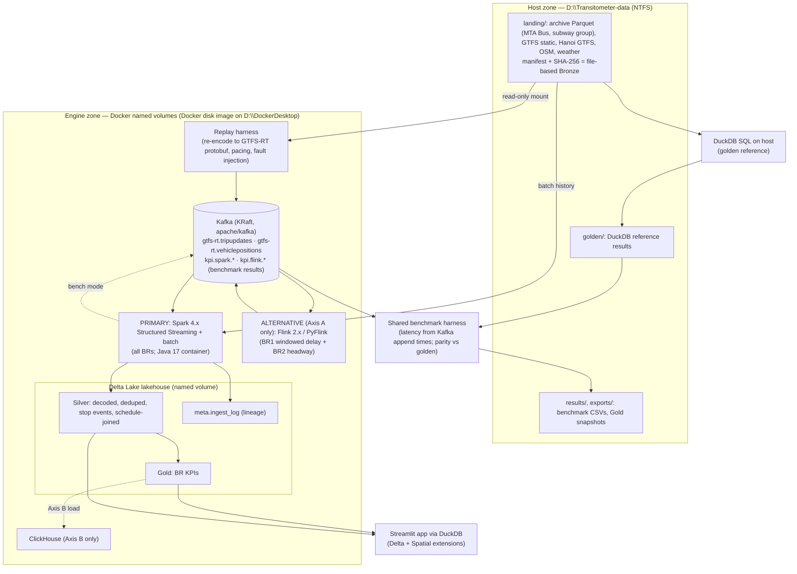

# PROJECT PLAN — Transitometer

**A Streaming + Lakehouse Data-Engineering Platform for Urban Transit Reliability Intelligence**

| | |
|---|---|
| **Course** | CO5173 Data Engineering — Semester 1, 2026-2027 (HCMUT) |
| **Assigned application domain** | Transportation |
| **Team** | 4 students — **logical ownership only** (runtime infrastructure is centralized) |
| **Runtime infrastructure** | **ONE machine** (this development host) — *not* four distributed laptops |
| **Collaboration / distribution** | **Git** (branches / pull requests) — Git is the collaboration mechanism, not extra runtime nodes |
| **Data policy** | Core = **real** transportation data; synthetic data only for fault injection / controlled tests (§1.1) |
| **Deliverable type** | Data-engineering system + data-driven application (not a CRUD app) |
| **Status** | Plan **v2.1** (v2 feasibility + storage revision; v2.1 rename + host prerequisites done) — **ready for S0 on owner go-ahead** |
| **Plan date** | v1 2026-09-23 · v2 2026-09-25 · **v2.1 2026-09-25** |
| **Repository** | `github.com/Lorcelmao/transitometer` (to be created in S0) |
| **Authoritative source** | `DE_Presentation and Project Descriptions and Requirements-Semester 1-2026-2027.pdf` (Project part only) |
| **Companion** | `IMPLEMENTATION_PLAN.md` (stages, tests, storage budget operations) |

> **STOP-BEFORE-IMPLEMENTATION NOTICE.** This document is the planning output. No production code has been
> written. Implementation begins only after explicit owner approval.

### v2 revision summary (2026-09-25)

Driven by a feasibility audit, verified research, and on-host measurements. All items owner-approved.

| # | Change | Reason (evidence) |
|---|---|---|
| 1 | **MinIO removed.** Delta Lake lives on a local Docker **named volume**. SeaweedFS (S3) = optional future extension only. | MinIO community edition discontinued; images removed from Docker Hub (§21). |
| 2 | **Spark = full production engine; Flink = Axis A comparison workload only.** Both emit benchmark results to **Kafka result topics**; only Spark writes Delta. | Legacy Delta–Flink connector deprecated in Delta 4.0; the Kernel-based replacement is experimental (§21). |
| 3 | **Spark and Flink run only in containers (Java 17).** No host JDK needed. | Host default Java is 23 (unsupported by Spark 4.x / Flink 2.x); PySpark on Windows needs `winutils`. |
| 4 | **Canonical stream = real archive data re-encoded to GTFS-RT protobuf** by the replay harness. | gtfsrt.io raw `.pb` bucket returns HTTP 403 (list *and* object GET) — measured 2026-09-25; the Parquet archive is public. |
| 5 | **Data scope = MTA Bus + one subway feed group; 14-day core window (reduced to 7 service days in S1); corridor-focused history.** | Measured archive volumes: MTA Bus ≈ 1.0 GB/day Parquet; all MTA subway+rail trip updates ≈ 0.67 GB/day. v1's "~90 days" ≈ 150 GB — unfit. |
| 6 | **Synthetic data only for fault injection / controlled tests.** Scale experiments use real day-slices. | Real MTA Bus data alone ≈ 3–4×10⁷ rows/day [E]. |
| 7 | **DuckDB SQL = independent golden reference**; pandas re-implementation dropped. | Removes a third copy of KPI logic; keeps an engine-independent oracle. |
| 8 | **DuckDB Spatial replaces PostGIS in core**; PostGIS optional. **FastAPI, Trino dropped. Metabase, Airflow, Neo4j → optional/discussion.** | Focus: depth over technology count. |
| 9 | **BR2 = stop-level headway from observed arrivals** (no GPS needed); GPS checks use MTA Bus vehicle positions. | MTA subway feeds carry trip updates only — no vehicle positions in the archive (measured). |
| 10 | **BR6 rule-based** (ML optional). **All BR acceptance on real days**; injected cases only in labelled unit tests. | v1 acceptance rows for BR2/BR5 contradicted rule R4. |
| 11 | **Walking skeleton in weeks 2–3**; "Docker-free until week 6" removed. | v1 back-loaded all integration risk into weeks 7–10. |
| 12 | **Two-zone storage; Docker footprint ≤ 25 GB steady** (§1.3; hard cap superseded by a soft guard in v2.1, item 15). | Owner storage constraint; measured Docker disk behaviour. |

### v2.1 addendum (2026-09-25)

| # | Change | Reason |
|---|---|---|
| 13 | **Project renamed TransitLens → Transitometer** (repo `transitometer`). | "TransitLens" is already used by two live GTFS-analytics products (app.transit-lens.com; transit-lens.vercel.app) and 13 GitHub repos. "Transitometer": 0 GitHub repos, no current software/product use found (only a 1950s bus-training simulator of that name). |
| 14 | **Axis B confirmed** as Spark SQL over Delta vs DuckDB over Delta vs ClickHouse. | Owner approval. |
| 15 | **Host prerequisites done** (Docker disk on D:, WSL 18 GB + swap on D:, data folders). **Docker hard disk limit replaced by a soft storage guard.** | Docker Desktop 4.54 (WSL2 mode) exposes no disk-limit setting; editing undocumented settings was rejected as unsafe (§17.4). |

The research notes in `01-research/`, `02-candidates/`, `03-data-sources/` are the **v1 research record**
and are not rewritten; where they mention TransitLens, MinIO, PostGIS-core, TfL-first, or 90-day windows, **this plan supersedes them**.

---

## 1. Executive summary

We will build **Transitometer**: an end-to-end data-engineering platform that answers a question no transit
dataset answers on its own — *"was the promised service actually delivered, where, when, and for whom?"*

The platform takes **static schedules (GTFS)** and **real archived GTFS-Realtime** data, replays the real-time
data as **protobuf events through Kafka**, processes it with **Spark Structured Streaming** (production engine)
into a **Delta Lake lakehouse** (Silver/Gold), and serves results through **DuckDB** (with the Delta and Spatial
extensions) to a **Streamlit** application. **Apache Flink** implements the same benchmark workload as the
mandatory **alternative processing solution**; **ClickHouse** is the serving alternative in the storage/serving
comparison. From the schedule↔observation join it derives on-time performance, headway regularity, bunching,
missing-trip detection, delay attribution and feed-quality scores for distinct user groups.

**Why this is data engineering, not an app:** every deliverable is a *pipeline output* produced by protobuf
decoding, streaming joins, event-time windowing, late-arrival handling, stateful trip reconstruction and
data-quality gates over noisy, out-of-order, repeated-snapshot feed data. A dashboard over a stock table cannot produce it.

**Why it satisfies the rubric:** ≥8 (we plan 11) demonstrable business requirements · 6–7 user groups ·
mandatory data-management **and** data-processing technologies from the instructor's menu (Kafka, Delta
lakehouse; Spark Streaming, Flink) · **two honest alternative-solution benchmarks** (processing axis required;
serving axis bonus) · systematic evaluation of **data correctness, performance, and data-exploitation effectiveness**.

**Locked decisions (owner-confirmed):**

1. **Real-data policy** (2026-09-23) — real GTFS static + real GTFS-RT; synthetic never replaces real data (§1.1).
2. **Single-machine runtime** (2026-09-23) — everything runs on this host; Git is the collaboration mechanism (§1.2).
3. Hybrid global-core + Vietnam case study · zero-cost local-only stack · archived replay (no 24/7 collector) · Python-first.
4. **v2 / v2.1 decisions** (2026-09-25) — items 1–15 in the revision tables above, including the storage policy (§1.3), the Axis B design, and the project name.

### 1.1 Data policy (binding) — real data, not simulated

| Rule | Statement |
|---|---|
| **R1 — Real by default** | The core system ingests and processes **real** transportation data: real **GTFS static** and real **GTFS-Realtime** observations from the public gtfsrt.io archive. |
| **R2 — Replay is still real** | Archived observations replayed through Kafka are *real data*, time-shifted. The replay harness **re-encodes** archived rows (one archived feed snapshot = one `source_file`) into standard GTFS-RT protobuf. Re-encoding changes the transport encoding, not the observations; provenance records "re-encoded from gtfsrt.io Parquet". |
| **R3 — Synthetic is for testing only** | Generated/injected data is allowed **only** for fault injection (duplicates, lateness, outages, malformed messages) and **labelled unit/controlled tests**. Scale experiments use **real** day-slices. |
| **R4 — Non-substitution** | Synthetic or injected data **must never** produce a business-requirement result, an acceptance-test result, or application content. |
| **R5 — Labelling** | Any figure/table using injected faults states so explicitly and is kept separate from real-data results. |

### 1.2 Runtime policy (binding) — one machine

- **Single host.** The development stack and the runnable system run on **one machine** (spec §17.4). Benchmarks are **single-machine / local** and never presented as distributed-cluster performance.
- **No distributed infrastructure.** Team members' machines are not infrastructure nodes; no shared cloud services in the runtime path.
- **Git is the collaboration mechanism.** Code, configs, notebooks, report sources and committed benchmark result CSVs move through Git (feature branch → PR → review → merge).
- **Sequential over simultaneous.** Engines run via **Docker Compose profiles, one at a time** — a resource-fit measure and a benchmark-fairness measure.
- **Reproducible from Git.** `git clone` → `python tasks.py fetch` → `python tasks.py up <profile>` → replay reproduces results on another capable Docker host (smaller slices where resources are lower).

### 1.3 Storage policy (binding, v2)

**Principle: Docker holds only reproducible working state. Everything of record lives on `D:\Transitometer-data` or in Git.**

| Zone | Location | Holds | Budget |
|---|---|---|---|
| **Host zone** | `D:\Transitometer-data\` (NTFS) | `landing/` immutable archive Parquet + GTFS static zips + manifest/checksums (the **file-based Bronze**); `golden/` reference results; `results/` benchmark CSVs + plots; `exports/` Gold snapshots for the report | ~20–30 GB [E] (larger is acceptable) |
| **Engine zone** | Docker named volumes inside Docker's disk image at **`D:\DockerDesktop\DockerDesktopWSL`** | Delta Silver/Gold + ingest-lineage table; Kafka log; Spark/Flink checkpoints; ClickHouse data (Axis B phase only); images; build cache | **≤ 25 GB steady**; soft guard warns at 25 GB and blocks new runs at 30 GB; ~30–35 GB temporary peaks only in scheduled phases |

- Host zone is read by host-side Python (fetch, DuckDB golden) and mounted **read-only** into the replay/ingest container. **No measured benchmark path reads from a Windows mount.**
- Engine zone data is rebuildable from the host zone + Git, so phase-boundary cleanup is safe.
- Budget, per-phase breakdown and cleanup operations: `IMPLEMENTATION_PLAN.md` §4.

---

## 2. Instructor PROJECT requirements → how this plan satisfies them

Extracted verbatim in `00-requirements/instructor-project-requirements.md`.

| ID | Requirement (from spec) | How Transitometer satisfies it |
|---|---|---|
| C1 | Unique Transportation domain framing | Urban transit reliability intelligence, NYC MTA core + Hanoi case study |
| C2 | Named key user groups / stakeholders | 7 user groups, each with a specific decision (§5) |
| C3 | ≥ 2n = **≥8 business requirements**, tied to objectives, demonstrable | **11 BRs** (8 core + 3 desirable/optional) (§7) |
| C4 | Rationale for how data engineering supports each BR | Full chain per BR (§7.3, §15.4) |
| C5 | Explicit data sources + data characteristics | Verified ledger with measured volumes (§8, §9) |
| C6 | Data-management **and** data-processing technologies | Management: **Kafka**, **Delta Lake lakehouse** (+ ClickHouse in Axis B). Processing: **Spark Structured Streaming**, **Flink** (§12) |
| C7 | **≥1 alternative solution** for comparison | Axis A (Spark vs Flink) mandatory; Axis B (serving) bonus (§13) |
| C8 | Executable application exposing DE results | Streamlit app, 7 user workflows (§14) |
| C9 | Systematic evaluation: correctness, performance, exploitation | Defined metrics + fairness contract (>85% criteria) (§15) |
| C10 | >3 illustrative technology examples | Kafka, Delta, Spark-SS, Flink, DuckDB, ClickHouse treated in depth + justified rejections (§12) |
| C11 | Full reproducible lifecycle | Manifest-driven fetch, pinned images, one-command replay, committed raw results (§19) |
| C12 | Report + slides + 20–30 min video + runnable product | Submission plan (§17.5) |

Also honoured: `"data management and processing aspects are focused"`, `"benchmarking ... especially in the
Big Data context"` (§13.4), and the bonus clause (more BRs, more user groups, more alternative solutions).

---

## 3. Problem definition, motivation, real-world context

**Problem.** Transit agencies publish a *plan* (GTFS static: routes, trips, stop times) and a *stream*
(GTFS-RT: trip updates, vehicle positions, alerts). Neither answers "was service delivered as promised?" That
answer must be **constructed**: decode repeated feed snapshots, infer what actually happened at each stop, match it
to the schedule, reconstruct each trip's state, detect late/early/missing/bunched service, attribute delay, and
score reliability — at scale and with defensible uncertainty.

**Motivation / value.** Reliability is the single biggest driver of transit ridership and perceived quality.
Agencies must report on-time performance transparently and justify schedule/resource changes with evidence; riders
need departure confidence, not timetables. This is a measurement and data-management problem before it is a UI problem.

**Real-world context (verified).** Deriving service-quality metrics from GTFS/GTFS-RT is an established
discipline (MBTA customer-weighted performance; TRB/SMARTER "Deriving Transit Performance Metrics from GTFS Data";
AVL-based bus-bunching research), so evaluation criteria are externally anchored.

**What makes it a data-engineering problem.** The metric exists in no source. It is produced by (a) **protobuf
decoding** of state-not-delta snapshots, (b) **inference of observed stop events** from repeated predictions and
positions, (c) a **schedule↔observation join** with service-day semantics, (d) **event-time windowing with
late-arrival handling**, (e) **stateful trip reconstruction**, and (f) **data-quality gating** on dirty feeds.

---

## 4. Selected direction & rationale (from candidate comparison)

Full analysis in `02-candidates/candidate-comparison.md`. Transitometer = **D1 (primary)** fused with
**G1-lite (feed-quality layer)** and **V0-lite (Vietnam case study)**.

| Candidate | Score | Verdict |
|---|---|---|
| D1 Urban transit reliability | **103** | **SELECTED (primary)** |
| D4 Maritime/port AIS | 94 | Rejected: US-only bulk AIS, heavy geospatial risk |
| G1 Feed-quality observatory | 94 | Fused as a *layer* (BR7), not standalone |
| D3 Aviation delay propagation | 93 | Rejected: monthly batch only; OpenSky access gated |
| D5 Shared mobility | 91 | Rejected: modest scale, GBFS has no history |
| D6 Road safety / D2 Accessibility | 90 / 89 | Deferred to optional enrichment |
| V0 Vietnam-only batch | 69 | Rejected as primary; retained as case study (no streaming, ~1.5 MB core) |

**Rationale.** D1 is the only candidate scoring ≥4 on every heavily-weighted criterion: obtainable licensed data ·
real streaming-shaped data · mandatory management+processing technologies · ≥8 demonstrable BRs · 5+ user groups ·
two honest benchmark axes with externally anchored correctness references.

**Rejected with reasons:** road congestion as primary (TomTom/INRIX/Waze gated or paid), freight & ride-hailing
(proprietary), predictive maintenance (no public labelled fleet), Vietnam-only streaming (no GTFS-RT exists), and
"live dashboard" as the deliverable (the pipeline output is the object of study).

---

## 5. Stakeholders & users (each with a concrete decision)

| # | User group | Decision they make | Served by |
|---|---|---|---|
| U1 | **Network operations controller** | Hold / short-turn / inject a relief vehicle *now* | Delay + bunching alerts, early warning (BR1, BR2, BR6) |
| U2 | **Scheduler / timetable planner** | Where to add running-time slack; where layover is insufficient | Segment travel-time distribution + attribution (BR4, BR9) |
| U3 | **Service planner** | Frequency / route changes; where reliability justifies investment | Route-stop-hour scorecards with uncertainty (BR1, BR5) |
| U4 | **Transit authority / performance manager** | Incentive/penalty; public reliability reporting | Scorecards, trends (BR5, BR9, BR10) |
| U5 | **Rider / rider-information analyst** | Whether to attempt a trip; what to surface at a stop | Departure-confidence explorer (BR8) |
| U6 | **Data / feed steward** | Which feeds to trust; when a feed regressed | Feed conformance / staleness / gaps (BR7, BR3) |
| U7 | **Hanoi transit planner** *(case study)* | Static network coverage & accessibility baseline | Hanoi GTFS analysis (BR11) |

**Business objectives:** reduce excess passenger wait time · raise on-time performance · eliminate bunched service ·
make reliability transparent and comparable · cut the cost of bad data via quality gates.

---

## 6. Data-driven application shape

One **Streamlit** application reading Gold/Silver Delta tables through **DuckDB** (Delta + Spatial extensions):

- **Reliability workspace** (U1–U4): replay-time map, route/stop scorecards, bunching and early-warning lists, trend explorer.
- **Departure-confidence explorer** (U5): per-stop/hour reliability for the next hour.
- **Feed health console** (U6): per-feed conformance, staleness, gap and regression indicators.
- **Hanoi network study** (U7, case study): static coverage/accessibility map via DuckDB Spatial.

The app's per-BR views are the *data-exploitation evidence*. A separate BI tool (Metabase) is optional (§20).

---

## 7. Business requirements

### 7.1 Core BRs (the mandated ≥8)

| BR | Statement | User | Type |
|---|---|---|---|
| **BR1** | Stop- and route-level **on-time performance** (−1 / +5 min band), by day/hour, with sample-coverage confidence | U1,U3,U4,U5 | Analytics/BI |
| **BR2** | **Headway regularity & bunching detection** from *observed stop arrivals* (headway outside ±20% of scheduled headway; bunched-pair identification), per route/direction/stop | U1,U3 | Data mining/DSS |
| **BR3** | **Missing-trip detection** — scheduled trips with no plausible observed service (delivered vs promised gap) | U1,U3,U6 | Analytics |
| **BR4** | **Segment travel-time distribution + delay attribution** (dwell vs running vs schedule slack); position-based segments on MTA Bus | U2,U3 | Analytics |
| **BR5** | **Reliability scorecard per route-stop-hour with statistical uncertainty** (bootstrap CI; defensible ranking) | U3,U4 | BI/DSS |
| **BR6** | **Streaming early warning (rule-based)**: flag in-progress trips projected to end late or bunched, from current delay trend + headway state; precision/recall measured on held-out real days. ML optional. | U1 | DSS |
| **BR7** | **Feed data-quality monitor**: staleness, snapshot gaps, implausible position jumps (MTA Bus GPS), unknown IDs, conformance score | U6 | Data correctness |
| **BR8** | **Rider-facing departure-reliability explorer** at stop level for the next hour | U5 | BI |

### 7.2 Desirable / optional BRs

| BR | Statement | User | Tier |
|---|---|---|---|
| **BR9** | **Historical corridor reliability trends** over the archive period (Jan 2026 →) for a selected corridor (batch path) | U2,U4 | Desirable |
| **BR10** | **Weather/context correlation** with reliability degradation (Open-Meteo) | U3,U4 | Desirable |
| **BR11** | **Hanoi static network coverage & accessibility baseline** — same static pipeline, DuckDB Spatial | U7 | Optional (case study) |

### 7.3 The full data-engineering chain (representative: BR2 bunching)

```
BUSINESS PROBLEM   Buses/trains arrive in pairs, doubling passenger wait on a route.
   -> USER         Network operations controller (U1) must decide whether to hold/short-turn/inject.
   -> REQ (BR2)    Detect bunching: observed headway outside ±20% of scheduled headway, per route/direction/stop.
   -> DATA NEEDED  GTFS static (stop_times, trips, routes, calendar) + GTFS-RT trip updates
                   (+ MTA Bus vehicle positions for stop-arrival confirmation).
   -> INGESTION    Archive Parquet (landing zone, D:) -> replay harness re-encodes each real snapshot to
                   GTFS-RT protobuf -> Kafka topics gtfs-rt.tripupdates / gtfs-rt.vehiclepositions
                   (one message per entity, keyed by trip_id / vehicle_id).
   -> MANAGEMENT   Delta Silver: decoded, deduped observations + inferred stop events joined to schedule;
                   partitioned by service_date. Lineage table records source_file, checksum, Kafka offsets.
   -> PROCESSING   Spark Structured Streaming: protobuf decode; watermark; dedup on (feed, entity_id, feed_timestamp);
                   stop-event inference (last prediction before a stop drops out / STOPPED_AT);
                   keyed stateful headway computation per (route, direction, stop).
   -> RESULT       bunched_pair events + headway_regularity KPI by route/hour (Gold Delta).
   -> APP          Bunching list/map for U1; route regularity chart for U3.
   -> USER VALUE   Faster intervention -> shorter waits; evidence for timetable fixes.
   -> DEMO         Replay a real day on which the golden run found bunching; show the alert and KPI change.
   -> EVALUATION   (a) Correctness: Spark vs DuckDB golden + hand-checked sample; conservation checks
                   (b) Performance: Axis A latency p50/p95/p99 (Spark vs Flink); throughput at SLO
                   (c) Exploitation: U1 task completed in-app; time-to-insight.
```

The same chain applies to BR1–BR11 (matrix §15.4).

---

## 8. Verified data sources (feasibility ledger)

Tags: **[V]** verified against primary source · **[M]** measured on this host 2026-09-24/25 · **[A]** assumption to verify in S1 · **[X]** rejected/unavailable.

| Source | Role | Access | Licence | Scale | Status |
|---|---|---|---|---|---|
| **gtfsrt.io Parquet archive** (`parquet.gtfsrt.io`) | **Canonical real-time source** (replay + batch) | Public bucket, listable, no auth; daily Parquet per feed, Hive-partitioned `<feed_type>/date=/base64url=` | AGPL-3.0 code; feed ToU apply | Archive starts **2026-01-04**; ~30 US feeds | **[V][M]** |
| └ MTA Bus (`gtfsrt.prod.obanyc.com`) | Core: bus trip updates **+ vehicle positions (GPS)** | via archive (no key) | MTA ToU | TU ≈ 863 MB/day, VP ≈ 139 MB/day Parquet | **[M]** |
| └ MTA subway feed group (e.g. `nyct/gtfs`, lines 1–7/S) | Core: subway trip updates | via archive | MTA ToU | ≈ 109 MB/day Parquet; **no vehicle positions archived** | **[M]** |
| gtfsrt.io raw protobuf (`protobuf.gtfsrt.io`) | — | **HTTP 403** on listing and on direct object GET | — | — | **[X][M]** → re-encode from Parquet (§1.1 R2) |
| gtfsrt.io versioned static schedules (`schedules.json`, `schedules/`) | Schedule truth for historical dates | Public | agency ToU | versions with validity windows; **includes MTA subway, not MTA Bus** | **[M]** |
| **MTA Bus GTFS static** (5 boroughs + MTA Bus Co.) | Schedule truth for bus | Versioned Parquet tables in the gtfsrt.io archive (`schedules/…/_feed_digest=`), pinned by digest | MTA ToU | 10⁵–10⁶ stop_times | **[M]** — S1: version 2026-09-06 → 2027-01-02 covers the window |
| **MTA live GTFS-RT** | Optional live mode only | Subway keyless; Bus Time needs free key | MTA ToU | 15–30 s cadence | **[V]** optional (§20) |
| **Mobility Database catalogue** | Feed metadata; historical static versions | Bulk JSON/CSV | Apache-2.0 repo; feeds own licences | 6,000+ feeds | **[V]** |
| **OpenStreetMap / Geofabrik** | Hanoi geospatial reference (BR11) | Bulk download | **ODbL 1.0** | VN extract ~hundreds of MB | **[V]** |
| **Open-Meteo** | Weather enrichment (BR10) | No key | CC-BY 4.0 | small | **[V]** |
| **World Bank Hanoi GTFS (0038236)** | Vietnam case study (BR11) | ZIP download | **CC-BY 4.0** | ~1.55 MB | **[V]** |
| NYC Open Data ridership | Demand context (optional) | Socrata, no auth | NYC Open Data | 10⁶–10⁷ rows | **[V]** optional |
| TfL Unified API | Fallback agency only | Free key | TfL terms | London-wide | **[V]** fallback |
| MinIO / Uber Movement / TransitFeeds / HCMC RT | — | — | — | — | **[X]** discontinued / nonexistent |

**Fallback ladder.** MTA Bus + subway (archive) → other archived agencies in gtfsrt.io (e.g. SEPTA, King County Metro,
Metro Transit — all with TU+VP) → TfL live collection. Archive availability risk is mitigated by downloading the core
window into the landing zone early (S1) with checksums.

---

## 9. Data characteristics (5 V's) — measured where possible

| Artifact | Format | Volume | Velocity | Veracity issues |
|---|---|---|---|---|
| Archive trip updates | Parquet, one row per stop-time-update per snapshot (flattened by archive) | MTA Bus ≈ 0.86 GB/day; subway group ≈ 0.11 GB/day **[M]** | snapshot every ~20–30 s, state-not-delta | massive repetition across snapshots, prediction drift, clock skew, missing trips |
| Archive vehicle positions | Parquet, one row per vehicle per snapshot (lat/lon, stop status) | MTA Bus ≈ 0.14 GB/day **[M]** | ~20–30 s | teleports, stale positions, null trip_id |
| Replayed stream | GTFS-RT protobuf, one Kafka message per entity | derived; bounded by replay window | paced (×1…×N real time) | injected lateness/duplicates only in fault tests |
| GTFS static | CSV-in-ZIP | 10–200 MB per feed | versions change every weeks–months | service calendars, `>24:00` times, ID churn across versions |
| Hanoi GTFS | CSV-in-ZIP | ~1.5 MB | one-off | provenance likely reconstructed |
| Weather | JSON API | small | hourly | gap-filling |

**Row counts (measured in S1).** The 7-service-day window (2026-09-17 → 09-23, fetched as 8 UTC partitions) holds
**1.48 × 10⁹ raw rows in 12.3 GB [M]** (≈ 1.9 × 10⁸ rows/day; weekday ≈ 1.66 GB/day). Silver is expected to be
1–2 orders of magnitude smaller after dedup/stop-event inference [E].

**Honest scale stance.** This is *medium* data (≈ 1.5 × 10⁹ raw rows) on one machine, not petabyte Big Data. We prove
scaling behaviour with **real day-slices (1 / 3 / 7 days)**, and we state where the architecture would
need a cluster. Every performance number is a single-machine result.

---

## 10. Data-engineering pipeline (end-to-end)

```
 SOURCES              LANDING (host zone, D:)         TRANSPORT            SILVER (Delta)             GOLD (Delta)          SERVE
 ───────              ───────────────────────         ─────────            ──────────────             ────────────          ─────
 gtfsrt.io Parquet ─► landing/ (immutable, manifest, ─► replay harness ─► Kafka ─► Spark-SS ─► decoded, deduped, ──► BR KPIs ──► DuckDB ──► Streamlit
                      checksums) = file-based Bronze    (re-encode to      (protobuf,  observations; inferred    (OTP, headway,  (Delta +
 GTFS static zips ──► landing/                          GTFS-RT pb,        per-entity) stop events; schedule-    bunching,       Spatial ext)
 Hanoi GTFS, OSM ───► landing/                          paced, faults)                 joined; quality-gated     missing trips,
 Open-Meteo ───────► landing/                                                         + lineage table           attribution,
                                                                                                                 scorecards, DQ)
 Batch path: landing/ Parquet (history corridor) ───────────────────────► Spark batch (same KPI code) ─► Silver/Gold
 Golden path: landing/ Parquet ─► DuckDB SQL on host (independent of Kafka, protobuf and Spark) ─► golden/
```

**Stages**
1. **Acquire (host)** — `fetch_data.py` downloads archive Parquet + GTFS static per `data-manifest.yaml` (URL, retrieval time, licence, SHA-256).
2. **Bronze = landing zone (file-based, host)** — immutable, checksummed raw files; the replayable source of truth. Bronze is deliberately *not* duplicated as a Delta payload table inside Docker; a Delta **lineage table** (`meta.ingest_log`: source_file, checksum, Kafka topic/partition/offset range, run id) preserves auditability.
3. **Replay (container)** — groups archive rows by `source_file` (= one real snapshot), rebuilds a GTFS-RT `FeedMessage`, emits one Kafka message per `FeedEntity` with headers (feed, snapshot timestamp, source_file); pacing by original timestamps × speed factor; optional fault injection (R3).
4. **Silver (Spark)** — protobuf decode; typing; dedup on `(feed, entity_id, feed_timestamp)`; stop-event inference; teleport/outlier suppression; schedule join with service-day and `>24:00` handling; quality gates; dead-letter table.
5. **Gold (Spark)** — BR1–BR8 KPIs (streaming where freshness matters: BR1, BR2, BR6, BR7; batch for BR3, BR4, BR5, BR8, BR9); `OPTIMIZE` + `VACUUM` maintenance.
6. **Serve** — DuckDB reads Gold/Silver Delta directly; Streamlit app. ClickHouse only in the Axis B comparison.
7. **Correctness** — DuckDB golden, property/invariant tests, conservation checks, re-processing determinism, Delta time-travel re-read of a corrected late arrival.

---

## 11. System & data architecture



**Deployment — single machine (binding, §1.2).** Host: ASUS TUF Gaming F15 (i7-12700H, 14C/20T, 31.6 GB RAM),
Windows 11 Home, Docker Desktop 4.54.0 (engine 29.1.2, Compose v2.40.3, WSL2 backend).

- **Services & Compose profiles:** `kafka` (no profile — always up in engine phases) · `spark` (Spark job + replay harness + DuckDB/Streamlit tooling, one custom image) · `flink` (JobManager + TaskManager, Axis A phase only) · `clickhouse` (Axis B phase only) · `app` (Streamlit, uses the Spark/tooling image). **Only one engine profile runs at a time.**
- **Storage placement:** two-zone policy (§1.3). Engine I/O stays on Linux ext4 volumes inside WSL2; the Windows mount is read-only input to the replay harness and batch loaders only.
- **Resource caps:** `.wslconfig` memory 18 GB with swap file on D: (applied 2026-09-25); pinned `spark.master=local[8]`, fixed Flink TaskManager slots/parallelism.
- **Docker disk image** relocated to `D:\DockerDesktop\DockerDesktopWSL` (done 2026-09-25); storage budget enforced by the soft guard (§1.3, §17.4).
- Orchestration: `tasks.py` (stdlib, cross-platform) tasks (`fetch`, `golden`, `up <profile>`, `replay`, `bench`, `clean-phase`, `storage-check`). Airflow optional.

---

## 12. Technology decisions & rationale

### 12.1 Adopted

| Layer | Technology | Why (requirements-driven) | Instructor menu? |
|---|---|---|---|
| Transport | **Apache Kafka (KRaft), official `apache/kafka` image** | Replayable, partitioned log = the *fairness backbone*: both engines read identical topics/offsets and write result topics; zstd + size-capped retention keeps it small. Also covers "Kafka Stream" on the menu. | ✅ |
| Table format / lakehouse | **Delta Lake on a local named volume** | ACID, schema enforcement, time travel (correction evidence), `OPTIMIZE`/`VACUUM`; native with Spark; readable by DuckDB. The lakehouse value is the table format, not S3. | ✅ (Databricks/lakehouse) |
| Processing (production) | **Spark 4.x Structured Streaming + batch (PySpark), Java 17 container** | One codebase for streaming and batch; event-time + watermark; arbitrary stateful processing for trip reconstruction; Python-first. | ✅ |
| Processing (alternative) | **Apache Flink 2.x (PyFlink), Java 17 container** | True per-event engine with event-time timers and side outputs → a real trade-off vs micro-batch, measured on an identical workload. | ✅ |
| Golden reference + app query engine | **DuckDB** (+ `delta`, `spatial` extensions) | Zero-infra independent oracle over landing Parquet; reads Delta for the app; spatial joins for stops/shapes and Hanoi. | (adjacent) |
| Serving alternative | **ClickHouse** | Columnar OLAP server; Axis B arm (latency, freshness, compression vs Delta-direct serving). | (adjacent) |
| Application | **Streamlit** | Fast to build; per-BR exploitation evidence; talks to DuckDB directly. | — |
| Correctness tooling | **pytest + Hypothesis-style property tests** | Turns correctness into numbers. | — |

**Version policy.** Exact versions pinned in S0: a Spark 4.x release paired with the Delta 4.x release that
supports it; Flink 2.x with the `flink-connector-kafka` release built for that Flink minor; images pinned by digest. Current pins (`docker/versions.env`): Spark 4.1.3 + `delta-spark_4.1_2.13` 4.4.0 + `spark-sql-kafka` 4.1.3; Flink 2.2.1 + connector 5.0.0-2.2; Kafka 4.3.1; ClickHouse 26.8.10.

### 12.2 Rejected / deferred (itself scorable "Technology Content")

| Technology | Decision · reason |
|---|---|
| **MinIO** | **Rejected** — community edition discontinued, images removed (§21). |
| **SeaweedFS (S3-compatible)** | **Optional future extension** — only if demonstrating S3 semantics becomes valuable; switching Delta paths `file:` → `s3a:` is the only change. |
| **Delta–Flink connector** | **Rejected** for this project — legacy connector deprecated in Delta 4.0; Kernel-based replacement experimental. Flink results go to Kafka instead. |
| **PostgreSQL + PostGIS** | **Optional** (BR11 isochrones / pgRouting). Core spatial work uses DuckDB Spatial. |
| **FastAPI** | **Dropped** — Streamlit queries DuckDB directly; no external API consumer exists. |
| **Trino** | **Dropped** — DuckDB and Spark SQL already read Delta. |
| **Metabase / Airflow** | **Optional** — Streamlit provides BI evidence; `tasks.py` suffices for orchestration. |
| **Neo4j** | **Discussion only** — third heavy service, low rubric value on one host. |
| **Bitnami images** | **Avoided** — use official Apache/vendor images only. |
| **Redshift / Synapse / BigQuery / Databricks paid / Confluent Cloud** | Excluded by zero-cost decision; recorded as discussed managed alternatives. |
| **Cassandra** | Advantage requires a real multi-node cluster; a 1-node benchmark would be a methodological hole. |
| **Hadoop MapReduce / Hive / Storm** | Legacy; superseded by Spark/Flink for event-time workloads. Discussed, not installed. |
| **Apache Druid** | 4–5 heavy containers; not viable on one host. |
| **CouchBase / RavenDB / DynamoDB** | On the menu but no natural fit for spatio-temporal transit data. |

---

## 13. Alternative solutions & benchmarking design

### 13.1 Axis A — Processing engine (MANDATORY alternative)
**Question:** *For real GTFS-RT delay and headway computation, what does a per-event engine (Flink) buy over
micro-batch (Spark Structured Streaming) in latency and late-data correctness, and what does it cost in complexity?*

| | A1 primary | A2 alternative |
|---|---|---|
| Engine | Spark Structured Streaming (trigger 10 s) | Flink (checkpoint 10 s) |
| Input | Kafka `gtfs-rt.*`, identical replayed window, **identical offsets** | same |
| Workload | **W1** 1-min tumbling event-time windows: delay stats per (route, stop). **W2** keyed stateful headway per (route, direction, stop) from inferred stop events | identical logic, same watermark policy |
| Sink | Kafka `kpi.spark.w1/w2` | Kafka `kpi.flink.w1/w2` |

**Measured:** processing latency p50/p95/p99 = output record Kafka append time − input record Kafka append time
(same broker clock) · sustained throughput at a latency SLO (find the knee by raising replay speed) · late-event
correctness at injected lateness 0/30/120 s (R3-labelled fault runs) · duplicate idempotency · restart-recovery time
after `kill -9` · peak memory · implementation/ops complexity.
**Correctness parity:** both result topics are dumped to Parquet on the host and graded against the **DuckDB golden**.
**Fairness (single host):** same topic + offsets, same logic/window/watermark, same resource caps, same replay pace,
cold start, ≥3 runs (median + min/max), counterbalanced arm order, only the arm under test running (`docker ps` check).
**Expected insight (falsifiable):** Flink → lower tail latency and cleaner late-data semantics; Spark → simpler, reuses
the batch path, higher throughput per unit of effort. No winner is pre-committed.

### 13.2 Axis B — Serving architecture (BONUS alternative)
**Question:** *What should serve the application's analytical queries at 10⁷–10⁸ Silver/Gold rows on one host?*

| | B1 Lakehouse engine | B2 Embedded columnar | B3 Columnar server |
|---|---|---|---|
| Stack | Spark SQL over Delta | DuckDB over Delta (`delta` extension) | ClickHouse `MergeTree` loaded from Delta |
| Workload | frozen 25-query suite (aggregations, windows, joins, time-travel read where supported) | same | same |

**Measured:** cold/warm p50/p95 per query · ingest→queryable freshness (B1/B2 read Delta directly; B3 needs a load) ·
storage footprint & compression · small-file / `OPTIMIZE` effect · **parity of all 25 results vs golden** · operator effort.
*Optional zero-copy sub-arm:* DuckDB `read_parquet` over the same Delta data files after `OPTIMIZE`+`VACUUM`, to isolate
Delta-log overhead. **Storage:** ClickHouse is the only extra copy; it is dropped after results are exported.

### 13.3 Axis C — removed
PostGIS/pgRouting vs Neo4j routing is **discussion-only** (§12.2).

### 13.4 Big-Data stance, provenance, and single-machine benchmarks
1. **Real data first.** All BR demonstrations and app content use real archived observations (re-encoded transport is still real — R2).
2. **Scale with real data.** Scaling curves use real 1/3/7-day slices; synthetic data is used only for labelled fault injection.
3. **Single-machine benchmarks.** Every performance number is a single-host Docker measurement published with the host spec and caps (§17.4); vendor benchmarks are cited only as prior art.

---

## 14. Application scope & user workflows

| Workflow | User | Screens / features | BRs |
|---|---|---|---|
| Reliability console | U1 | replay-time map, delay/bunching alerts, early-warning list | BR1, BR2, BR6 |
| Timetable diagnostics | U2 | segment travel-time distributions, delay attribution | BR4, BR9 |
| Planning & scorecards | U3 | route-stop-hour scorecards with CI, ranking | BR1, BR5 |
| Authority reporting | U4 | reliability trends, exportable scorecards | BR5, BR9, BR10 |
| Departure confidence | U5 | stop-level next-hour reliability explorer | BR8 |
| Feed health console | U6 | per-feed conformance/staleness/gap/jump indicators | BR3, BR7 |
| Hanoi network study | U7 | static coverage/accessibility map (DuckDB Spatial) | BR11 |

**UI guidance (rubric "User Interface Design 2/10"):** fit each user group (controller = glanceable alerts; planner =
dense charts; rider = simple confidence indicator); consistent navigation, colour semantics, no clutter.

---

## 15. Evaluation strategy

### 15.1 Data correctness
DuckDB golden over landing Parquet — independent of Kafka, protobuf re-encoding and Spark — so it also validates the
replay/decode chain. Every engine graded against it. Property/invariant tests: conservation
`events_in = events_out + late_dropped + dead_lettered`; no result references an unknown `trip_id`; coordinates in
service bbox; no timestamp before service start; re-encode round-trip (archive rows → protobuf → decoded rows equal on
all used fields). Dedup idempotency; late-event windowing at 0/30/120 s (labelled fault runs); **re-processing
determinism**; **Delta time-travel re-read** of a corrected late arrival.

### 15.2 Performance
Latency p50/p95/p99 (never mean-only) · throughput knee at latency SLO · Kafka consumer lag · recovery time after
`kill -9` · query latency cold vs warm per query · compression ratio · compaction effect · scaling curve on real slices.
**Fairness contract** (published before benchmarking): identical data + checksums, identical logic/windows/watermarks,
same host and caps, symmetric tuning, disclosed warm-up, ≥3 runs with spread, one variable per experiment, cold/warm
separated, explicit "what we did not test". All results are single-machine/local.

### 15.3 Application effectiveness
Per-BR demonstrability matrix (>85% of 11 BRs demonstrable = ≥10) · time-to-insight per defined analyst task ·
freshness (age of KPI at view time) · BR coverage vs required 8.

### 15.4 BR → data → processing → app → evaluation matrix

| BR | DE output | App exploitation | Correctness evidence (real data) | Performance evidence |
|---|---|---|---|---|
| BR1 | OTP KPI (Gold) | scorecards, map | Spark vs golden on a real sample day | Axis A W1 latency; freshness |
| BR2 | bunched-pair events | alert list, regularity chart | real bunching day found by golden + hand-checked pairs | Axis A W2 latency p95 |
| BR3 | missing-trip list | gap report | scheduled − observed = detected list, vs golden | batch run time |
| BR4 | travel-time dist + attribution | diagnostics view | attribution components sum to total delay | Axis B query latency |
| BR5 | scorecard + bootstrap CI | ranking table | CI recomputed independently in DuckDB; stability across resamples | Axis B query latency |
| BR6 | early-warning flags | warning list | precision/recall on held-out real day | streaming latency |
| BR7 | feed-quality score | feed console | cross-check vs independent DuckDB checks on landing data | replay/ingest cost |
| BR8 | per-stop reliability | rider explorer | parity with BR1 for same stop/hour | serving latency |
| BR9 | corridor trends | trend explorer | batch vs golden parity on corridor | batch scaling on real slices |
| BR10 | weather correlation | correlation view | rain-day attribution check | join cost |
| BR11 | Hanoi coverage | VN map | GTFS validity report | static load time |

---

## 16. Scope control

**CORE (must ship):** archive landing + manifest · replay harness (protobuf re-encode) · Kafka · Spark Silver/Gold on
Delta · **BR1–BR8** · DuckDB golden + correctness suite · **Axis A** (Spark vs Flink) · **Axis B** (Spark SQL vs DuckDB
vs ClickHouse) · Streamlit app for U1–U6 · evaluation (correctness, performance, exploitation) · one-command reproducible
stack within the storage policy.

**DESIRABLE:** BR9 (corridor history) · BR10 (weather) · BR11 Hanoi static study · G1-lite feed-quality comparison across
several archived agencies.

**OPTIONAL / STRETCH (must not endanger core):** SeaweedFS S3 variant · PostGIS/pgRouting · Metabase · Airflow · live
polling mode (MTA Bus Time key) · ML-based BR6 · Lambda-vs-Kappa divergence study.

**Removed (explicit):** MinIO · FastAPI · Trino · Neo4j/Axis C · Delta sink from Flink · synthetic scale generator ·
Docker-free Spark/Flink development · 90-day multi-agency window.

---

## 17. Implementation roadmap

### 17.1 Phases & milestones (~15-week semester)

| Phase | Weeks | Deliverable | Exit criterion |
|---|---|---|---|
| **P0 Foundation** | 1–3 | Host prerequisites, repo, pinned images, data landing, **walking skeleton**, storage calibration | 1 real hour: landing → replay (protobuf) → Kafka → Spark → Delta → DuckDB → Streamlit chart; storage budget re-validated |
| **P1 Replay + golden** | 3–6 | Full replay harness; canonical schemas; DuckDB golden KPIs | Re-encode round-trip passes; golden OTP/headways reproduced on sample day; **FREEZE dataset + 25-query suite (end wk 6)** |
| **P2 Production pipeline** | 6–9 | Spark Silver + Gold BR1–BR8 (streaming + batch) | Spark matches golden within tolerance; conservation checks pass |
| **P3 Alternatives + benchmarks** | 8–11 | Flink Axis A workload; ClickHouse + Axis B; shared harness; runs | Axis A and B results with p50/p95/p99 + parity; phase cleanup done |
| **P4 Application + exploitation** | 6–12 | Streamlit app U1–U7 | All core BRs demonstrated in-app on real data |
| **P5 Evaluation + hardening** | 12–13 | E2E from clean clone; evaluation chapter; desirable BRs | >85% evaluation criteria defined and evidenced |
| **P6 Submission** | 14–15 | Report, slides, 20–30 min video, runnable product | All artifacts complete, group-ID named |

> Detailed stages (S0–S14), per-stage tests, storage operations and quality gates: `IMPLEMENTATION_PLAN.md`.

### 17.2 Team division (4 members)

| Member | Ownership | Primary BRs |
|---|---|---|
| **M1** | Data acquisition, landing manifest, **replay harness** (fairness backbone) | BR3, BR7 |
| **M2** | Walking skeleton lead; **Spark** Silver/Gold; Delta maintenance | BR1, BR2, BR6 |
| **M3** | **Flink** Axis A; **ClickHouse** Axis B; **shared benchmark harness** | BR4, BR5 |
| **M4** | **DuckDB golden**, correctness suite, **Streamlit app** | BR8, BR9 |

All four: BRs, report, slides, video. **The benchmark harness is shared code, not per-person scripts.**
Ownership is logical: one Git repository; heavy runs on the single host, scheduled; host-side work (golden SQL,
tests, app views against small exports, report) proceeds in parallel.

### 17.3 Dependencies
Walking skeleton (wk 2–3) de-risks every later integration. Replay harness blocks both benchmark arms → front-loaded.
Golden dataset blocks all correctness claims. Dataset + query freeze (end wk 6) blocks benchmarking.

### 17.4 Infrastructure — one machine

| Resource | Measured (2026-09-24/25) |
|---|---|
| Machine | ASUS TUF Gaming F15 FX507ZM — Windows 11 Home, x64 |
| CPU / RAM | Intel Core i7-12700H, 14 cores / 20 logical · 31.6 GB |
| Disks | C: SK Hynix 512 GB NVMe — 453.5 GB, **98.2 GB free** · D: Samsung 980 1 TB NVMe (separate disk) — 931.5 GB, **191.1 GB free** (2026-09-25, after Docker relocation) |
| Container runtime | Docker Desktop 4.54.0, engine 29.1.2, Compose v2.40.3, WSL2; containerd image store on |
| Docker disk image | `D:\DockerDesktop\DockerDesktopWSL\disk\docker_data.vhdx`, 1.44 GB (empty engine), non-sparse |
| WSL resources | `.wslconfig`: `memory=18GB` (engine reports 18.9 GB), `swapFile=D:\WSL\swap.vhdx`; 20 logical CPUs visible |
| Host Java / Python | Java 23 (not used by the stack) · Python 3.10 (host tooling only) |
| Cost | $0 |

**Host prerequisites — status (2026-09-25):**
1. ✅ Docker disk image relocated to D: (owner, via Docker Desktop settings); old C: image removed; `hello-world` verified.
2. ⚠️ **No hard disk-usage limit**: Docker Desktop 4.54 in WSL2 mode exposes no such setting; editing undocumented settings was rejected (risk of engine start failure or mid-write "disk full"). **Replacement:** S0 soft storage guard (`python tasks.py storage-check`: warn ≥ 25 GB, refuse to start new runs ≥ 30 GB) + the §1.3 controls.
3. ✅ `.wslconfig` memory 18 GB + swap on D: (backup: `%USERPROFILE%\.wslconfig.bak-20260925`).
4. ✅ `D:\Transitometer-data\{landing,golden,results,exports}` created.
5. Ongoing: stray-container hygiene — no unrelated containers with restart policies during benchmarks.

**Operating rules.** Two-zone storage (§1.3); sequential profiles; heavy engines never co-run; benchmarks on an idle host;
phase-boundary cleanup and Docker disk compaction (`IMPLEMENTATION_PLAN.md` §4).

### 17.5 Submission (per spec)
Final technical **report PDF (10%)** · **presentation PDF (5%)** · **20–30 min video mp4/webm (5%)** · **runnable product
(15%)** — all named with the **group ID**.

---

## 18. Risks & fallbacks

| Risk | P×D | Mitigation / fallback |
|---|---|---|
| Scope explosion | High | Core fixed (§16); everything else is optional with explicit rejection reasons |
| Unfair benchmark | High | Fairness contract published first; shared harness; identical offsets; Kafka-append-time latency |
| Late integration failure (Spark/Delta/Kafka/Flink versions) | High→Med | Walking skeleton wk 2–3; pinned version pairs; baked connector jars |
| Archive availability / format change (gtfsrt.io) | Med | Download core window + history early into landing with checksums; fallback agencies in the same archive |
| Raw protobuf unavailable | — | **Resolved**: re-encode from Parquet; round-trip test guarantees fidelity on used fields |
| MTA Bus static schedule versions for past dates | Med | Verify in S1 (MTA + Mobility Database); BR9 history defaults to the subway group, whose static versions are archived |
| Stop-event inference inaccuracy | Med | Golden + hand-checked samples; documented inference rules and tolerance |
| Docker footprint above budget | Med | Two-zone policy; phase-scoped images; Kafka size caps; Silver/Gold only; ClickHouse dropped after Axis B; soft storage guard (no hard limit available in Docker Desktop 4.54 WSL2 mode) |
| Docker disk image keeps high-water size (non-sparse) | Med | Compaction at phase boundaries; peaks confined to scheduled phases |
| Single-host resource contention | Med-High | One engine profile at a time; pinned threads; 18 GB WSL cap; `docker ps` pre-check |
| Single point of failure (one host) | Med | Code in Git remote; data re-fetchable from manifest; results CSVs committed; engine zone rebuildable |
| Timezone / service-day bugs | Med | Golden + invariant tests; `>24:00` handling; DST test cases |
| Demo depends on the host | Low | Pre-recorded demo; archived replay; clean-clone reproducibility |

---

## 19. Reproducibility & artifacts

**Real-data provenance.** Every BR result traces to a landing file with source URL, retrieval timestamp, licence and
SHA-256; the lineage table maps Kafka offsets back to `source_file`. Re-encoding is deterministic and tested.

**Reproducibility.** Official images pinned by digest (`apache/kafka`, Apache Spark, `flink`, `clickhouse/clickhouse-server`)
· two custom images only (Spark+tooling, Flink+PyFlink) with connector jars and DuckDB extensions baked in ·
build contexts limited to `docker/spark-tools/` and `docker/flink-py/` (no data can enter an image) · version manifest (OS, Docker, image digests, CPU, RAM, caps) ·
`docker compose config` dump · documented replay pace/fault settings · committed raw result CSVs + plotting scripts.
**Environment statement:** all results are single-machine/local on the host in §17.4.

**Git as the distribution mechanism.** `git clone` → `python tasks.py fetch` → `python tasks.py up spark` → `python tasks.py replay` reproduces on any
capable Docker host. **Group ID naming** is required on all submissions.

---

## 20. Optional extensions (post-core)

SeaweedFS S3 substrate · PostGIS/pgRouting isochrones for Hanoi · Metabase dashboards · Airflow orchestration · live
polling mode (MTA Bus Time key, subway keyless) · ML early warning (BR6+) · multi-agency federation from the archive ·
equity/safety overlays · natural-language query over Gold KPIs.

---

## 21. References (primary sources)

**Specification:** `DE_Presentation and Project Descriptions and Requirements-Semester 1-2026-2027.pdf` (CO5173).

**Data & standards:** gtfs.org/documentation/realtime/reference · gtfsrt.io (archive layout, no-auth Parquet) ·
parquet.gtfsrt.io bucket listing + schedules.json (measured 2026-09-24/25) · mobilitydatabase.org · mta.info/developers ·
download.geofabrik.de · open-meteo.com · World Bank dataset 0038236 (Hanoi GTFS) · data.cityofnewyork.us.

**Technology (v2 verification, accessed 2026-09-25):**
- Spark 4.0 release notes (Java 17 default, Java 21 support): spark.apache.org/releases/spark-release-4-0-0.html
- Flink Java compatibility (Java 17 default in 2.x): nightlies.apache.org/flink/flink-docs-stable/docs/deployment/java_compatibility/
- Flink 2.1 release notes (PyFlink Python 3.9–3.12): nightlies.apache.org/flink/flink-docs-stable/release-notes/flink-2.1/
- Flink Kafka connector for 2.0: nightlies.apache.org/flink/flink-docs-release-2.0/docs/connectors/datastream/kafka/
- Delta 4.2 release (Kernel-based Flink connector, legacy deprecated in 4.0): delta.io/blog/2026-04-17-delta-4-2-released/ · github.com/delta-io/delta/releases
- MinIO discontinuation: blog.vonng.com/en/db/minio-is-dead/ · stablebuild.com/blog/minio-images-disappeared-from-docker-hub
- S3 alternatives survey: akmatori.com/blog/minio-alternatives-2026-comparison · infoq.com/news/2025/12/minio-s3-api-alternatives/

**Methodology / domain:** TRB/SMARTER "Deriving Transit Performance Metrics from GTFS Data" · MBTA customer-weighted OTP
methodology · AVL-based bus-bunching research (PDXScholar) · TRB/ROSA "Using GTFS Data to Evaluate and Improve Public
Transit Equity".

*(v1 annotated URL list: `01-research/data-engineering-technology-landscape.md` §9 and `03-data-sources/*.md`.)*

---

## 22. Unresolved questions

1. **Group ID and member names** — needed at submission.
2. ~~MTA Bus GTFS static historical versions~~ — **resolved in S1:** versioned bus schedules are archived by gtfsrt.io; the 7-day window sits inside one bus and one subway version.
3. **Corridor selection for BR9** — which subway lines / bus routes; decided in S1 from measured volume.
4. **Data-set freeze date** — planned end of week 6; confirm against the course calendar.
5. **Instructor confirmation** that a NYC-core + Hanoi case-study framing is acceptable under "domain = Transportation".
6. **Instructor confirmation** on the ">3 illustrative examples" interpretation.
7. ~~Git remote~~ — **resolved:** `github.com/Lorcelmao/transitometer`; branch/PR policy per `IMPLEMENTATION_PLAN.md` §7; visibility (public/private) to confirm at creation.
8. **Host availability windows** for benchmark runs; **emergency fallback host** identified via Git.
9. **Whether to promote BR11** (Vietnam) from optional to desirable for local relevance.

---

*End of planning phase (v2). Awaiting owner review and explicit approval before implementation begins.*
