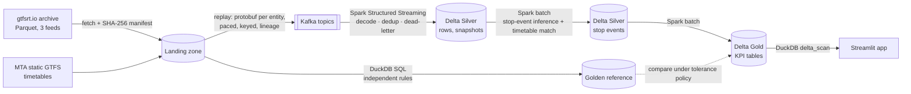

# Transitometer

**Was the promised transit service actually delivered?** Transitometer is a streaming and lakehouse data pipeline that measures bus and subway reliability from real GTFS-Realtime feeds. It covers on-time performance, headway regularity and bunching, and feed data quality. Every number it produces is checked against an independently built reference. CO5173 Data Engineering course project (HCMUT).

- Real data: archived New York MTA feeds (bus trip updates, bus vehicle positions, subway 1–7/S trip updates) from [gtfsrt.io](https://gtfsrt.io), plus the matching static timetables.
- Pipeline: protobuf replay into **Kafka** → **Spark Structured Streaming** (PySpark) → **Delta Lake** Silver and Gold → **DuckDB** → **Streamlit** app.
- Correctness: an independent **DuckDB SQL** batch pipeline over the raw archive is the golden reference. Spark output must match it within a written tolerance policy ([`golden/tolerance.json`](golden/tolerance.json)).

## Architecture



| Layer | Technology | What happens |
|---|---|---|
| Ingest | Python, gtfs-realtime-bindings, Kafka | Archived snapshots are re-encoded to GTFS-RT protobuf, one message per trip or vehicle, keyed by trip/vehicle id. The replay is paced by feed time (×speed) with an idempotent producer and records per-snapshot offset lineage. |
| Silver | Spark Structured Streaming, Delta | `from_protobuf` decoding; exact-duplicate removal within a 10 min event-time watermark; a dead-letter table for undecodable or incomplete messages; a conservation check (in = kept + duplicates + late + dead-lettered); exactly-once Delta sink (re-runs append nothing). |
| Silver events | Spark (batch) | Stop arrivals inferred from successive predictions, matched to the timetable in three tiers, with service-day handling for trips past midnight. |
| Gold | Spark (batch), Delta | BR1 on-time performance (−1/+5 min band) per route and hour; BR2 observed headways classified as regular, bunched or gap. |
| Serve | DuckDB + Streamlit | The app reads Gold Delta tables (or the frozen golden tables) through one data-access layer. |

## Quickstart

Requirements: Python 3.10+, Docker Desktop (Compose v2), about 35 GB free disk for Docker.

```bash
python -m venv .venv
# Windows: .venv\Scripts\activate    macOS/Linux: source .venv/bin/activate
python -m pip install -e ".[dev]"
cp config/.env.example config/.env      # set TRANSITOMETER_DATA_ROOT to a folder outside the repo

python tasks.py fetch                   # pinned real data into <data root>/landing (verified)
python tasks.py build                   # Spark tooling image
python tasks.py demo                    # one real hour end to end, then the app
```

`demo` replays one real hour of all three feeds through Kafka, Spark Silver, stop-event inference and Gold, then starts the app at <http://localhost:8501>. Each step prints its progress. `python tasks.py down` stops everything; data volumes are kept.

To browse the app without running the pipeline, start it on the frozen golden tables: `TRANSITOMETER_APP_SOURCE=golden python tasks.py up app`.

## Full golden-window run and validation

```bash
python tasks.py replay            # golden window (2 service days, 3 feeds) into Kafka
python tasks.py replay-verify     # counts, markers, ordering, sampled field fidelity
python tasks.py silver            # Kafka -> Silver Delta
python tasks.py silver-events     # stop events, compared with golden -> results/validation-silver.json
python tasks.py gold              # Gold KPIs, compared with golden -> results/validation-gold.json
python tasks.py golden            # (re)build the golden reference with DuckDB
```

## Results

<!-- results: filled from results/*.json -->

## Tasks

All commands go through `python tasks.py <task>` (works on every OS):

| Task | What it does |
|---|---|
| `check` | lint + typecheck + tests |
| `fetch`, `validate-landing` | download and validate the pinned sources (manifest with SHA-256) |
| `build`, `up <profile>`, `down` | build the image, start services, stop everything (volumes kept) |
| `replay`, `replay-verify` | replay archived feeds into Kafka; verify the stream against the archive |
| `silver`, `silver-events`, `gold` | Spark jobs; `silver-events` and `gold` also compare with golden |
| `demo [--fresh]` | one real hour end to end, then the app |
| `golden`, `golden-check` | build the DuckDB golden reference; check result tables against it |
| `storage-check`, `storage-report` | storage guard (warn at 30 GB, refuse engine starts at 35 GB) and usage log |

Runs on any topic prefix other than `rt` (for example the demo) write to their own lakehouse subtree and report folder (`results/scratch/<prefix>/`), so they never touch the validated tables.

## Repository map

- `src/transitometer/replay/`: archive → protobuf → Kafka, verification
- `src/transitometer/pipeline/`: Spark jobs (`silver_ingest`, `silver_events`, `gold_kpis`) and export
- `src/transitometer/golden/`: DuckDB golden SQL, tolerance comparison, 25-query suite
- `src/transitometer/serve/`, `src/transitometer/app/`: data-access layer and Streamlit app
- `PROJECT_PLAN.md`: scope, users and business requirements; `IMPLEMENTATION_PLAN.md`: stages and tests

## Roadmap

The MVP covers BR1 (on-time performance), BR2 (headways and bunching) and the data-quality foundation for BR7. Next: BR3 missing trips and the BR7 feed-quality score, then BR4–BR6 and BR8. After that come the benchmarked alternatives (Flink for processing, ClickHouse for serving) and the Ho Chi Minh City static network case study. See `IMPLEMENTATION_PLAN.md`.

## Storage rules

Data never goes into Git. Raw/landing data, golden results and exports live in the host data root (`TRANSITOMETER_DATA_ROOT`); Docker holds only rebuildable working state and should stay at or below 25 GB.

## Collaboration

Feature branch → pull request → review by at least one other member → merge to `main`.
`main` must always pass `python tasks.py check`.
